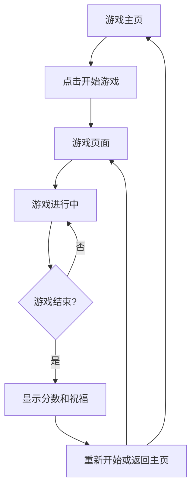

## 1. Product Overview
一个充满新年氛围的贪吃蛇游戏网站，专为克劳德的孩子子鱼设计的新年礼物。游戏采用喜庆的新年主题设计，界面友好适合儿童操作，让孩子在欢乐的游戏体验中感受新年祝福。

## 2. Core Features

### 2.1 User Roles
| Role | Registration Method | Core Permissions |
|------|---------------------|------------------|
| 玩家 | 无需注册 | 开始游戏、暂停游戏、查看分数、重新开始 |

### 2.2 Feature Module
新年贪吃蛇游戏网站包含以下主要页面：
1. **游戏主页**：新年主题背景、游戏标题、开始游戏按钮、游戏说明。
2. **游戏页面**：贪吃蛇游戏区域、分数显示、暂停/继续按钮、返回主页按钮。

### 2.3 Page Details
| Page Name | Module Name | Feature description |
|-----------|-------------|---------------------|
| 游戏主页 | 新年主题背景 | 显示红色和金色为主的新年装饰背景，包含灯笼、烟花、福字等新年元素。 |
| 游戏主页 | 游戏标题 | 显示"子鱼的新年贪吃蛇"标题，使用可爱的卡通字体。 |
| 游戏主页 | 开始游戏按钮 | 点击后进入游戏页面，按钮设计成红包形状，点击时有动画效果。 |
| 游戏主页 | 游戏说明 | 简单说明游戏规则，使用图文并茂的方式，适合儿童理解。 |
| 游戏页面 | 游戏区域 | 贪吃蛇游戏主要区域，蛇身设计成彩色糖果形状，食物设计成金币或元宝形状。 |
| 游戏页面 | 分数显示 | 实时显示当前分数和最高分数，分数数字使用金色字体。 |
| 游戏页面 | 游戏控制 | 暂停/继续按钮，返回主页按钮，按钮设计符合新年主题。 |
| 游戏页面 | 游戏结束 | 游戏结束时显示新年祝福语和最终分数，提供重新开始选项。 |

## 3. Core Process
游戏流程：
1. 玩家进入主页，看到新年主题的游戏界面
2. 点击开始游戏按钮，进入游戏页面
3. 使用键盘方向键控制贪吃蛇移动
4. 吃到食物获得分数，蛇身变长
5. 游戏结束后显示祝福和分数，可选择重新开始或返回主页

## 4. User Interface Design

### 4.1 Design Style
- 主色调：红色 (#FF4444) 和金色 (#FFD700)
- 辅助色：深红色 (#CC0000)、橙色 (#FFA500)
- 按钮样式：圆角设计，3D立体效果，悬停时有缩放动画
- 字体：可爱卡通风格字体，主标题大字号(32px+)，正文适中(16-18px)
- 布局风格：居中布局，卡片式设计，背景使用渐变效果
- 图标风格：使用emoji表情和新年符号，如🧧🍬🪙

### 4.2 Page Design Overview
| Page Name | Module Name | UI Elements |
|-----------|-------------|-------------|
| 游戏主页 | 背景装饰 | 红色渐变背景，顶部漂浮的灯笼动画，底部烟花绽放效果，金色边框装饰。 |
| 游戏主页 | 标题区域 | 中央显示"子鱼的新年贪吃蛇"，字体金色发光效果，下方有小鱼emoji装饰。 |
| 游戏主页 | 开始按钮 | 红包形状的按钮，红色主体金色边框，悬停时轻微放大，点击时打开动画。 |
| 游戏页面 | 游戏区域 | 黑色背景的游戏网格，边框金色发光，蛇身为彩色糖果emoji，食物为金币emoji。 |
| 游戏页面 | 分数面板 | 金色边框的信息面板，显示当前分数、最高分数，使用大号金色数字。 |
| 游戏页面 | 控制按钮 | 圆形按钮，暂停按钮为⏸️图标，返回按钮为🏠图标，悬停时有旋转效果。 |

### 4.3 Responsiveness
采用桌面端优先设计，同时适配平板设备。游戏区域大小固定为800x600像素，在小屏幕上保持比例缩放。按钮和文字大小会根据屏幕尺寸适当调整，确保儿童操作的便利性。

### 4.4 交互设计
- 键盘控制：使用方向键控制蛇的移动
- 触摸控制：在移动设备上提供屏幕虚拟方向键
- 音效反馈：吃到食物时播放欢快的音效，游戏结束时播放新年祝福音乐
- 视觉反馈：蛇吃到食物时有粒子爆炸效果，分数增加时有数字跳动动画