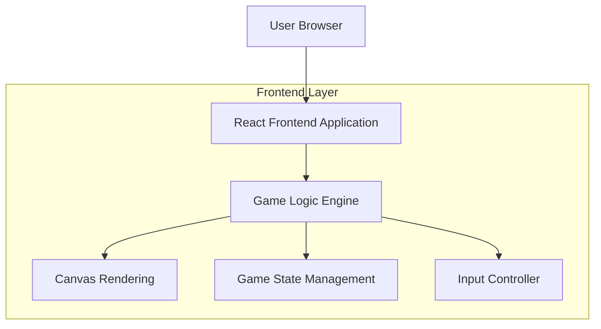
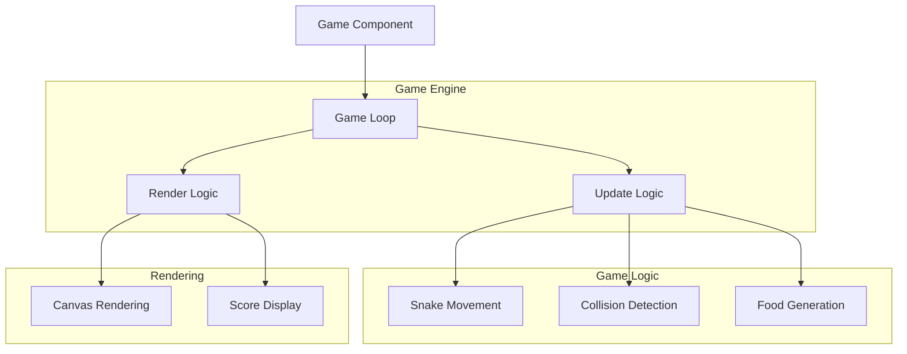

## 1. Architecture design



## 2. Technology Description

- Frontend: React@18 + Vite + HTML5 Canvas
- Initialization Tool: vite-init
- Backend: None (纯前端应用)
- 状态管理: React useState + useEffect
- 游戏引擎: 原生JavaScript游戏循环

## 3. Route definitions

| Route | Purpose |
|-------|---------|
| / | 游戏主页，显示新年主题界面和开始按钮 |
| /game | 游戏页面，主要的贪吃蛇游戏区域 |

## 4. Core Components

### 4.1 游戏核心组件

```typescript
// 游戏状态接口
interface GameState {
  snake: Position[];
  food: Position;
  direction: Direction;
  score: number;
  gameOver: boolean;
  isPaused: boolean;
}

interface Position {
  x: number;
  y: number;
}

enum Direction {
  UP = 'UP',
  DOWN = 'DOWN',
  LEFT = 'LEFT',
  RIGHT = 'RIGHT'
}

// 游戏配置
interface GameConfig {
  gridSize: number;
  gameSpeed: number;
  canvasWidth: number;
  canvasHeight: number;
}
```

### 4.2 主要组件结构

```typescript
// 主页组件
interface HomePageProps {
  onStartGame: () => void;
}

// 游戏页面组件
interface GamePageProps {
  onBackToHome: () => void;
}

// 游戏画布组件
interface GameCanvasProps {
  gameState: GameState;
  onGameOver: (score: number) => void;
  onScoreUpdate: (score: number) => void;
}
```

## 5. 游戏架构设计



## 6. 游戏逻辑实现

### 6.1 游戏循环
- 使用 `requestAnimationFrame` 实现平滑的游戏循环
- 游戏速度通过帧率控制，可调节难度
- 暂停功能通过暂停游戏循环实现

### 6.2 碰撞检测
- 边界碰撞：检测蛇头是否超出画布边界
- 自身碰撞：检测蛇头是否与身体其他部分重叠
- 食物碰撞：检测蛇头是否与食物位置重合

### 6.3 输入控制
- 键盘事件监听：方向键控制蛇的移动
- 触摸事件支持：移动设备上的虚拟方向键
- 防止反向移动：不允许直接反向移动

## 7. 渲染系统

### 7.1 Canvas 渲染
- 使用 HTML5 Canvas API 进行游戏渲染
- 蛇身渲染：彩色糖果emoji或彩色方块
- 食物渲染：金币emoji或金色圆形
- 背景渲染：网格线和装饰元素

### 7.2 动画效果
- 吃到食物时的粒子爆炸效果
- 分数增加时的数字跳动动画
- 按钮悬停时的缩放和旋转效果
- 新年装饰的漂浮动画

## 8. 音效系统

### 8.1 音效资源
- 吃到食物音效：欢快的"叮"声
- 游戏结束音效：新年祝福音乐片段
- 按钮点击音效：轻微的"咔嗒"声

### 8.2 音效管理
- 使用 Web Audio API 播放音效
- 音量控制和静音选项
- 音效预加载机制

## 9. 响应式设计

### 9.1 布局适配
- 固定游戏区域：800x600像素
- 小屏幕适配：按比例缩放
- 触摸控制：移动设备优化

### 9.2 性能优化
- Canvas 双缓冲技术减少闪烁
- 游戏对象池减少内存分配
- 帧率控制保证流畅性

## 10. 本地存储

### 10.1 数据存储
- 最高分数：使用 localStorage 保存
- 游戏设置：音效开关、游戏速度等偏好设置
- 存储键名：使用有意义的前缀避免冲突

### 10.2 数据接口
```typescript
interface LocalStorageService {
  getHighScore(): number;
  setHighScore(score: number): void;
  getSettings(): GameSettings;
  setSettings(settings: GameSettings): void;
}
```